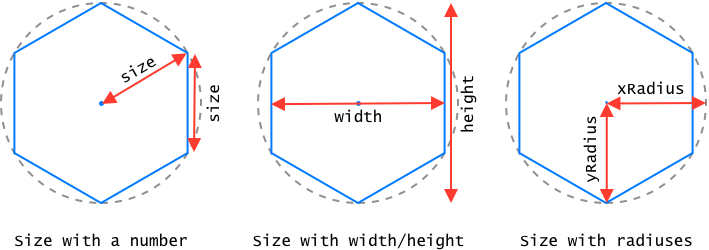

# Honeycomb

## Next major version

The alpha of the next major version (v4) is released (see the [changelog](https://github.com/flauwekeul/honeycomb/blob/next/CHANGELOG.md) in the [`next`](https://github.com/flauwekeul/honeycomb/tree/next) branch). It's a complete rewrite in TypeScript with all new shiny "traversers" 😎.

I could really use your feedback about this new version, so please take a look at the [readme](https://github.com/flauwekeul/honeycomb/tree/next#honeycomb) in the [`next`](https://github.com/flauwekeul/honeycomb/tree/next) branch to see how you can start using it. Please open an [issue](https://github.com/flauwekeul/honeycomb/issues) and tell me what you like and/or don't like. Thanks! ✨

* * *

[](https://gitter.im/honeycomb-grid)
[](https://www.npmjs.com/package/honeycomb-grid)
[](https://david-dm.org/flauwekeul/honeycomb)
[](https://david-dm.org/flauwekeul/honeycomb?type=dev)
[](https://github.com/flauwekeul/honeycomb/blob/master/LICENSE)

Another hex grid library made in JavaScript, heavily inspired by [Red Blob Games'](http://www.redblobgames.com/grids/hexagons/) blog posts and code samples.

All existing JS hex grid libraries I could find are coupled with some form of view. Most often a `<canvas>` element or the browser DOM. I want more separation of concerns…and a new hobby project to spend countless hours on.

### Features

-   🙌 Works in (modern) browsers and in Node.js.
-   📐 Create hex grids in different shapes: ▭ rectangles, △ triangles, ⬡ hexagons and ▱ parallelograms.
-   🌐 2 coordinate systems: cartesian (`x` and `y`) and cube (`q`, `r` and `s`).
-   ✨ Create your own hexes by extending the built-in hex factory.
-   🗺 Convert points to hexes and vice versa.
-   ⬢ Pointy and ⬣ flat hexes.
-   🖥 Lets you decide if and how hexes are rendered.

## Installation

NPM:

```bash
npm i --save honeycomb-grid
```

Yarn:

```bash
yarn add honeycomb-grid
```

Or download the minified file from [unpkg.com](https://unpkg.com/honeycomb-grid/dist/honeycomb.min.js).

## Getting started

### Browser

Honeycomb works at least in recent versions of Chrome, Firefox, Edge and Safari.

```html
<script src="honeycomb.js"></script>

<script>
    const Grid = Honeycomb.defineGrid()
    Grid.rectangle({ width: 4, height: 4 })
</script>
```

### Node.js

```javascript
const Honeycomb = require('honeycomb-grid')

const Grid = Honeycomb.defineGrid()
Grid.rectangle({ width: 4, height: 4 })
```

### With ES2015 modules

```javascript
import { defineGrid } from 'honeycomb-grid'

const Grid = defineGrid()
Grid.rectangle({ width: 4, height: 4 })
```

## Examples

### Basic usage

Create a hex grid in 3 steps:

```javascript
// 1.  (optionally) create a Hex factory by extending the default:
const Hex = Honeycomb.extendHex({
    size: 30,           // default: 1
    orientation: 'flat' // default: 'pointy'
})

// 2.  create a Grid factory that uses the Hex factory:
const Grid = Honeycomb.defineGrid(Hex)

// 3a. create a grid with a "shape" method:
const grid1 = Grid.rectangle({ width: 4, height: 4 })
// [
//    { x: 0, y: 0 },
//    { x: 0, y: 1 },
//    { x: 0, y: 2 },
//    …
// ]

// 3b. or create a grid from individual hexes/points:
const grid2 = Grid(Hex(1, 2), [3, 4], { x: 5, y: 6 })
// [
//    { x: 1, y: 2 },
//    { x: 3, y: 4 },
//    { x: 5, y: 6 }
// ]
```

### Rendering

Honeycomb comes without the ability to render hexes to screen. Fortunately, it isn't very hard. Especially if you use a dedicated rendering library.

#### With [PixiJS](http://www.pixijs.com/)

```javascript
const app = new PIXI.Application({ transparent: true })
const graphics = new PIXI.Graphics()

const Hex = Honeycomb.extendHex({ size: 5 })
const Grid = Honeycomb.defineGrid(Hex)

document.body.appendChild(app.view)
// set a line style of 1px wide and color #999
graphics.lineStyle(1, 0x999999)

// render 10,000 hexes
Grid.rectangle({ width: 100, height: 100 }).forEach(hex => {
    const point = hex.toPoint()
    // add the hex's position to each of its corner points
    const corners = hex.corners().map(corner => corner.add(point))
    // separate the first from the other corners
    const [firstCorner, ...otherCorners] = corners

    // move the "pen" to the first corner
    graphics.moveTo(firstCorner.x, firstCorner.y)
    // draw lines to the other corners
    otherCorners.forEach(({ x, y }) => graphics.lineTo(x, y))
    // finish at the first corner
    graphics.lineTo(firstCorner.x, firstCorner.y)

    app.stage.addChild(graphics)
})
```

[Try it in JSFiddle](https://jsfiddle.net/Flauwekeul/qmfgey44/).

#### With [SVG.js](http://svgjs.com/)

```javascript
const draw = SVG().addTo('body').size('100%', '100%')

const Hex = Honeycomb.extendHex({ size: 5 })
const Grid = Honeycomb.defineGrid(Hex)
// get the corners of a hex (they're the same for all hexes created with the same Hex factory)
const corners = Hex().corners()
// an SVG symbol can be reused
const hexSymbol = draw.symbol()
    // map the corners' positions to a string and create a polygon
    .polygon(corners.map(({ x, y }) => `${x},${y}`))
    .fill('none')
    .stroke({ width: 1, color: '#999' })

// render 10,000 hexes
Grid.rectangle({ width: 100, height: 100 }).forEach(hex => {
    const { x, y } = hex.toPoint()
    // use hexSymbol and set its position for each hex
    draw.use(hexSymbol).translate(x, y)
})
```

[Try it in JSFiddle](https://jsfiddle.net/Flauwekeul/0vm2azj2/).

### Grids extend `Array.prototype`

Most properties/methods of grids are the same as their Array counterpart:

```javascript
const grid = Grid.rectangle({ width: 4, height: 4 })

grid.length // 16
grid.pop()  // { x: 3, y: 3 }
grid.length // 15
grid[4]     // { x: 1, y: 0 }
```

Some Grid methods are augmented. For example: [`Array#includes`](https://developer.mozilla.org/nl/docs/Web/JavaScript/Reference/Global_Objects/Array/includes) always returns `false` when passed an object literal because it uses [strict equality](https://developer.mozilla.org/nl/docs/Web/JavaScript/Equality_comparisons_and_sameness) internally. [`Grid#includes`](#includes) _only_ accepts object literals (in the form of [points](#point-2)):

```javascript
const array = [{ x: 1, y: 0 }]
array.includes({ x: 1, y: 0 })  // false

const grid = Grid(Hex(1, 0))
grid.includes({ x: 1, y: 0 })   // true
```

#### Grid methods that mutate

Methods that mutate the grid in-place ([Grid#push](#push), [Grid#splice](#splice) and [Grid#unshift](#unshift)) only accept valid hexes to prevent "grid corruption" 👮‍.

```javascript
const grid = Grid()             // []

// this silently fails:
grid.push('invalid hex')        // 0 <- the grid's length, which remains 0
grid.includes('invalid hex')    // false
```

Keep in mind that methods that return a new grid (e.g. [Grid#map](#map)) can create grids with invalid hexes:

```javascript
const grid = Grid.rectangle({ width: 4, height: 4 })

const newGrid = grid.map(hex => 'invalid hex')
// [
//    'invalid hex',
//    'invalid hex',
//    'invalid hex',
//    …
// ]
```

#### Be careful with bracket notation

It's possible to add an invalid hex to a grid by using bracket notation:

```javascript
const grid = Grid(Hex())

grid[0]                     // { x: 0, y: 0 }
grid[0] = 'invalid hex'
grid[0]                     // 'invalid hex' ⚠️
```

Use [`Grid#get`](#get) and [`Grid#set`](#set) instead:

```javascript
const grid = Grid(Hex())

grid.get(0)                 // { x: 0, y: 0 }
grid.set(0, 'invalid hex')
grid.get(0)                 // { x: 0, y: 0 } <- invalid hex is ignored

// Grid#set() also accepts a point:
grid.set({ x: 0, y: 0 }, Hex(-1, 3))
// …as does Grid#get():
grid.get([-1, 3])           // { x: -1, y: 3 }
```

### Point → Hex

Translating a screen point (pixel) to the corresponding hex in a grid is possible with [`Grid.pointToHex()`](#pointtohex).

```javascript
const Hex = Honeycomb.extendHex({ size: 30 })
const Grid = Honeycomb.defineGrid(Hex)
const grid = Grid.rectangle({ width: 10, height: 10 })

document.addEventListener('click', ({ offsetX, offsetY }) => {
    // convert point to hex (coordinates)
    const hexCoordinates = Grid.pointToHex(offsetX, offsetY)
    // get the actual hex from the grid
    console.log(grid.get(hexCoordinates))
})
```

See a more elaborate example in [JSFiddle](https://jsfiddle.net/Flauwekeul/3bd6sa9r/).

### Grid shapes

Honeycomb offers 4 shape methods: [rectangle](#rectangle), [triangle](#triangle), [hexagon](#hexagon) and [parallelogram](#parallelogram). [Try them out in JSFiddle](https://jsfiddle.net/Flauwekeul/arxo1vqo/).

### Coordinate systems

The standard coordinate system is a [cartesian](https://en.wikipedia.org/wiki/Cartesian_coordinate_system) one. It's intuitive and easy to reason about. A lot of methods internally use a "cube" coordinate system. See [this redblobgames.com blog post](https://www.redblobgames.com/grids/hexagons/#coordinates) for an explanation between the two (he calls the cartesian system "offset coordinates").

Hexes have getters for each of the cube coordinates `q`, `r` and `s`:

```javascript
const Hex = Honeycomb.extendHex()
const hex = Hex(3, 4)

hex.q           // 1
hex.r           // 4
hex.s           // -5

hex.cartesian() // { x: 3, y: 4 }
hex.cube()      // { q: 1, r: 4, s: -5 }
```

There are methods for converting between cartesian and cube:

```javascript
const Hex = Honeycomb.extendHex()
const hex = Hex()

hex.toCube({ x: 3, y: 4 })      // { q: 1, r: 4, s: -5 }

// Hex#toCartesian doesn't require the s coordinate:
hex.toCartesian({ q: 1, r: 4 }) // { x: 3, y: 4 }
```

> These methods always require coordinates to be passed and don't work on a hex instance, even though they're instance methods. This will be fixed in a future release 🙃

Hexes can also be created from cube coordinates:

```javascript
const Hex = Honeycomb.extendHex()
Hex({ q: 1, r: 4, s: -5 })  // { x: 3, y: 4 }
```

### Odd or even hex offsets

In a grid with pointy hexes, each row is offsetted half a hex relative to the previous row. In grids with flat hexes, this applies to the columns. Redblobgames.com has a [visual example](https://www.redblobgames.com/grids/hexagons/#coordinates-offset).

Set the `offset` property to `1` or `-1` (default) to control whether the even or odd rows/columns are offsetted. [Try it out in JSFiddle](https://jsfiddle.net/Flauwekeul/36jot1h7/).

### (De)serialization

Since version 3 it's possible to properly [serialize and deserialize](https://en.wikipedia.org/wiki/Serialization) grids (including their Hex factory). This can be done using `JSON.stringify()` and `JSON.parse()`:

```javascript
const hexPrototype = { size: 10, custom: 'some value' }
const Hex = Honeycomb.extendHex(hexPrototype)
const Grid = Honeycomb.defineGrid(Hex)
const grid = Grid.rectangle({ width: 2, height: 2 })

const serializedGrid = JSON.stringify(grid)
// [{"x":0,"y":0},{"x":1,"y":0},{"x":0,"y":1},{"x":1,"y":1}]

const deserializedGrid = JSON.parse(serializedGrid)
// [
//     { x: 0, y: 0 },
//     { x: 1, y: 0 },
//     { x: 0, y: 1 },
//     { x: 1, y: 1 }
// ]
```

You can define a [`toJSON()` method](https://developer.mozilla.org/en-US/docs/Web/JavaScript/Reference/Global_Objects/JSON/stringify#toJSON()_behavior) on your Hex prototype to control how a grid is serialized:

```javascript
const hexPrototype = {
    toJSON() { return [this.x, this.y] }
}
const Hex = Honeycomb.extendHex(hexPrototype)
const Grid = Honeycomb.defineGrid(Hex)
const grid = Grid.rectangle({ width: 2, height: 2 })

const serializedGrid = JSON.stringify(grid)
// [[0,0],[1,0],[0,1],[1,1]]
```

Any Hex factory has a (static) `toJSON()` method that makes it easy to get a Hex's prototype:

```javascript
const Hex = Honeycomb.extendHex({
    size: 10,
    custom: 'some value'
})

Hex.toJSON()        // {size: 10, custom: "some value"}

// Hex.toJSON() is called automatically when passed to JSON.stringify():
JSON.stringify(Hex) // {"size":10,"custom":"some value"}
```

## API

<!-- Generated by documentation.js. Update this documentation by updating the source code. -->

#### Table of Contents

-   [Honeycomb](#honeycomb)
    -   [defineGrid](#definegrid)
        -   [Parameters](#parameters)
        -   [Examples](#examples)
    -   [extendHex](#extendhex)
        -   [Parameters](#parameters-1)
        -   [Examples](#examples-1)
    -   [Point](#point)
-   [Grid](#grid)
    -   [Parameters](#parameters-2)
    -   [Examples](#examples-2)
    -   [fill](#fill)
    -   [get](#get)
        -   [Parameters](#parameters-3)
        -   [Examples](#examples-3)
    -   [hexesBetween](#hexesbetween)
        -   [Parameters](#parameters-4)
        -   [Examples](#examples-4)
    -   [hexesInRange](#hexesinrange)
        -   [Parameters](#parameters-5)
        -   [Examples](#examples-5)
    -   [includes](#includes)
        -   [Parameters](#parameters-6)
        -   [Examples](#examples-6)
    -   [indexOf](#indexof)
        -   [Parameters](#parameters-7)
        -   [Examples](#examples-7)
    -   [lastIndexOf](#lastindexof)
        -   [Parameters](#parameters-8)
        -   [Examples](#examples-8)
    -   [neighborsOf](#neighborsof)
        -   [Parameters](#parameters-9)
        -   [Examples](#examples-9)
    -   [pointHeight](#pointheight)
    -   [pointWidth](#pointwidth)
    -   [push](#push)
        -   [Parameters](#parameters-10)
        -   [Examples](#examples-10)
    -   [set](#set)
        -   [Parameters](#parameters-11)
        -   [Examples](#examples-11)
    -   [splice](#splice)
        -   [Parameters](#parameters-12)
        -   [Examples](#examples-12)
    -   [unshift](#unshift)
        -   [Parameters](#parameters-13)
        -   [Examples](#examples-13)
    -   [Hex](#hex)
    -   [hexagon](#hexagon)
        -   [Parameters](#parameters-14)
    -   [isValidHex](#isvalidhex)
        -   [Parameters](#parameters-15)
    -   [parallelogram](#parallelogram)
        -   [Parameters](#parameters-16)
    -   [pointToHex](#pointtohex)
        -   [Parameters](#parameters-17)
        -   [Examples](#examples-14)
    -   [rectangle](#rectangle)
        -   [Parameters](#parameters-18)
    -   [ring](#ring)
        -   [Parameters](#parameters-19)
    -   [spiral](#spiral)
        -   [Parameters](#parameters-20)
    -   [triangle](#triangle)
        -   [Parameters](#parameters-21)
-   [Hex](#hex-1)
    -   [Parameters](#parameters-22)
    -   [Examples](#examples-15)
    -   [add](#add)
        -   [Parameters](#parameters-23)
    -   [cartesian](#cartesian)
    -   [cartesianToCube](#cartesiantocube)
        -   [Parameters](#parameters-24)
        -   [Examples](#examples-16)
    -   [center](#center)
        -   [Examples](#examples-17)
    -   [coordinates](#coordinates)
        -   [Examples](#examples-18)
    -   [corners](#corners)
        -   [Examples](#examples-19)
    -   [cube](#cube)
        -   [Examples](#examples-20)
    -   [cubeToCartesian](#cubetocartesian)
        -   [Parameters](#parameters-25)
        -   [Examples](#examples-21)
    -   [distance](#distance)
        -   [Parameters](#parameters-26)
        -   [Examples](#examples-22)
    -   [equals](#equals)
        -   [Parameters](#parameters-27)
    -   [fromPoint](#frompoint)
        -   [Parameters](#parameters-28)
        -   [Examples](#examples-23)
    -   [height](#height)
    -   [isFlat](#isflat)
    -   [isPointy](#ispointy)
    -   [lerp](#lerp)
        -   [Parameters](#parameters-29)
    -   [nudge](#nudge)
    -   [offset](#offset)
    -   [orientation](#orientation)
    -   [origin](#origin)
    -   [q](#q)
    -   [r](#r)
    -   [round](#round)
        -   [Examples](#examples-24)
    -   [s](#s)
    -   [set](#set-1)
        -   [Parameters](#parameters-30)
        -   [Examples](#examples-25)
    -   [size](#size)
    -   [subtract](#subtract)
        -   [Parameters](#parameters-31)
    -   [toCartesian](#tocartesian)
    -   [toCube](#tocube)
    -   [toPoint](#topoint)
        -   [Examples](#examples-26)
    -   [toString](#tostring)
    -   [width](#width)
    -   [thirdCoordinate](#thirdcoordinate)
        -   [Parameters](#parameters-32)
        -   [Examples](#examples-27)
-   [Point](#point-1)
    -   [Parameters](#parameters-33)
    -   [Examples](#examples-28)
    -   [add](#add-1)
        -   [Parameters](#parameters-34)
    -   [divide](#divide)
        -   [Parameters](#parameters-35)
    -   [multiply](#multiply)
        -   [Parameters](#parameters-36)
    -   [subtract](#subtract-1)
        -   [Parameters](#parameters-37)
-   [Instances](#instances)
    -   [grid](#grid-1)
        -   [Properties](#properties)
    -   [hex](#hex-2)
        -   [Properties](#properties-1)
    -   [point](#point-2)
        -   [Properties](#properties-2)
-   [Constants](#constants)
    -   [OFFSET](#offset-1)
        -   [Properties](#properties-3)
    -   [COMPASS_DIRECTION](#compass_direction)
        -   [Properties](#properties-4)
-   [Other](#other)
    -   [onCreate](#oncreate)
        -   [Parameters](#parameters-38)

### Honeycomb

Type: [Object](https://developer.mozilla.org/docs/Web/JavaScript/Reference/Global_Objects/Object)

#### defineGrid

This function can be used to create [Grid](#grid) factories by passing it a [Hex](#hex) factory.

##### Parameters

-   `Hex` **[Hex](#hex)** A [Hex](#hex) factory.
                                             If nothing is passed, the default Hex factory is used by calling `Honeycomb.extendHex()` internally. (optional, default `Honeycomb.extendHex()`)

##### Examples

```javascript
// create a Grid factory that uses the default Hex Factory:
const Grid = Honeycomb.defineGrid()
const hex = Grid.Hex()
hex.size         // { xRadius: 1, yRadius: 1 }

// create your own Hex factory
const CustomHex = Honeycomb.extendHex({ size: 10, custom: '🤓' })
// …and pass it to defineGrid() to create a Grid factory that produces your custom hexes
const CustomGrid = Honeycomb.defineGrid(CustomHex)
const customHex = CustomGrid.Hex()
customHex.size   // { xRadius: 10, yRadius: 10 }
customHex.custom // 🤓
```

Returns **[Grid](#grid)** A Grid factory.

#### extendHex

This function can be used to create custom hexes by extending the default Hex prototype.

All properties of the object passed to `extendHex()` will be added to the prototype of the resulting [Hex](#hex) factory.
To add properties to individual hexes (instances), pass them to the [Hex](#hex) factory.

##### Parameters

-   `prototype` **[Object](https://developer.mozilla.org/docs/Web/JavaScript/Reference/Global_Objects/Object)** An object that's used as the prototype for all hexes in a grid.
                                     **Warning:** properties in this object will overwrite properties with the same name in the default prototype. (optional, default `{}`)

##### Examples

```javascript
const Hex = Honeycomb.extendHex({
    size: 50,
    orientation: 'flat',
    customProperty: `I'm custom 😃`,
    customMethod() {
        return `${this.customProperty} and called from a custom method 😎`
    }
})
const hex = Hex(5, -1)

hex.coordinates()    // { x: 5, y: -1 }
// size is normalized to an object containing an x radius and y radius:
hex.size             // { xRadius: 50, yRadius: 50 }
hex.customProperty   // I'm custom 😃
hex.customMethod()   // I'm custom 😃 and called from a custom method 😎

// every hex created with Hex() shares these properties:
const hex2 = Hex(3, 0)
hex2.size            // { xRadius: 50, yRadius: 50 }
hex2.customProperty  // I'm custom 😃

// to set properties on individual hexes, pass them to Hex():
const hex3 = Hex(-2, -1, { instanceProperty: `I'm a unique snowflake 😌` })
hex3.instanceProperty    // I'm a unique snowflake 😌
```

Returns **[Hex](#hex)** A function to produce hexes that are all linked to the same prototype.

#### Point

See [Point](#point).

### Grid

A function to create hex [grid](#grid)s and perform various operations on them.

A Grid factory has several static methods that return [grid](#grid)s of hexes in a certain shape.
It can also be called with 1 or more points/hexes or an array of points/hexes to create a [grid](#grid) instance.

A [grid](#grid) extends `Array.prototype`, with some methods overwritten and some new methods added.

#### Parameters

-   `points` **...[point](#point)?** An array of points/hexes or separate arguments that are points/hexes.

#### Examples

```javascript
const Grid = Honeycomb.defineGrid()
// the Hex factory used by the Grid to produce hexes is available as a property
const Hex = Grid.Hex

Grid(Hex(3, -1), Hex(2, 0))      // [{ x: 3, y: -1 }, { x: 2, y: 0 }]
Grid([Hex(3, -1), Hex(2, 0)])    // [{ x: 3, y: -1 }, { x: 2, y: 0 }]

// it also accepts points
Grid({ x: 3, y: -1 }, [2, 0])    // [{ x: 3, y: -1 }, { x: 2, y: 0 }]
Grid([{ x: 3, y: -1 }, [2, 0]])  // [{ x: 3, y: -1 }, { x: 2, y: 0 }]

// clone a grid:
const grid = Grid(Hex(), Hex(1), Hex(2))
const clonedGrid = Grid(grid)      // [{ x: 0, y: 0 }, { x: 1, y: 1 }, { x: 2, y: 2 }]
grid === clonedGrid                // false
```

Returns **[grid](#grid)** A grid instance containing only valid hexes.

#### fill

-   Throws **[TypeError](https://developer.mozilla.org/docs/Web/JavaScript/Reference/Global_Objects/TypeError)** It makes no sense for a grid to fill it with arbitrary values, because it should only contain valid hexes.

Returns **[TypeError](https://developer.mozilla.org/docs/Web/JavaScript/Reference/Global_Objects/TypeError)** An error.

#### get

Get a hex from a grid.

##### Parameters

-   `keyOrPoint` **([number](https://developer.mozilla.org/docs/Web/JavaScript/Reference/Global_Objects/Number) \| [point](#point))** An index/key or a point.

##### Examples

```javascript
const Grid = Honeycomb.defineGrid()
const Hex = Grid.Hex
const grid = Grid.rectangle({ width: 2, height: 2 })

grid.get(0)              // { x: 0, y: 0 }
grid.get(Hex(0, 1))      // { x: 0, y: 1 }
grid.get({ x: 0, y: 1 }) // { x: 0, y: 1 }
grid.get([0, 1])         // { x: 0, y: 1 }

grid.get(42)             // undefined
grid.get(Hex(6, -2))     // undefined
```

Returns **[hex](#hex)** The found hex or `undefined`.

#### hexesBetween

-   **See: [redblobgames.com](https://www.redblobgames.com/grids/hexagons/#line-drawing)
    **

##### Parameters

-   `firstHex` **[hex](#hex)** The first hex.
-   `lastHex` **[hex](#hex)** The last hex.

##### Examples

```javascript
const Grid = Honeycomb.defineGrid()
const Hex = Grid.Hex
const grid = Grid.rectangle({ width: 4, height: 4 })

grid.hexesBetween(Hex(), Hex(3)) // [
                                 //    { x: 0, y: 0 },
                                 //    { x: 0, y: 1 },
                                 //    { x: 1, y: 1 },
                                 //    { x: 2, y: 2 },
                                 //    { x: 3, y: 2 },
                                 //    { x: 3, y: 3 },
                                 // ]
```

Returns **[Array](https://developer.mozilla.org/docs/Web/JavaScript/Reference/Global_Objects/Array)&lt;[hex](#hex)>** Array (not a [grid](#grid)) of hexes in a straight line from `firstHex` to (and including) `lastHex`.

#### hexesInRange

-   **See: [redblobgames.com](https://www.redblobgames.com/grids/hexagons/#range-coordinate)
    **

##### Parameters

-   `centerHex` **[hex](#hex)** A hex to get surrounding hexes from.
-   `range` **[number](https://developer.mozilla.org/docs/Web/JavaScript/Reference/Global_Objects/Number)** The range (in hexes) surrounding the center hex. (optional, default `0`)
-   `includeCenterHex` **[boolean](https://developer.mozilla.org/docs/Web/JavaScript/Reference/Global_Objects/Boolean)** Whether to include the center hex in the result (optional, default `true`)

##### Examples

```javascript
const Hex = Honeycomb.extendHex({ orientation: 'pointy' })
const Grid = Honeycomb.defineGrid(Hex)
const grid = Grid.rectangle({ width: 5, height: 5 })

grid.hexesInRange(Hex(2, 2), 2)          // [
                                         //    { x: 0, y: 2 },
                                         //    { x: 0, y: 3 },
                                         //    { x: 1, y: 4 },
                                         //    ...
                                         //    { x: 3, y: 0 },
                                         //    { x: 3, y: 1 },
                                         //    { x: 4, y: 2 }
                                         // ]

// only returns hexes that exist in the grid:
grid.hexesInRange(Hex(0, 0), 1)          // [
                                         //    { x: 0, y: 0 },
                                         //    { x: 0, y: 1 },
                                         //    { x: 1, y: 0 }
                                         // ]

// exclude center hex:
grid.hexesInRange(Hex(2, 2), 1, false)   // [
                                         //    { x: 1, y: 2 },
                                         //    { x: 1, y: 3 },
                                         //    { x: 1, y: 1 },
                                         //    { x: 2, y: 3 },
                                         //    { x: 3, y: 2 }
                                         // ]
```

-   Throws **[Error](https://developer.mozilla.org/docs/Web/JavaScript/Reference/Global_Objects/Error)** When no valid hex is passed.

Returns **[Array](https://developer.mozilla.org/docs/Web/JavaScript/Reference/Global_Objects/Array)&lt;[hex](#hex)>** An array with all hexes surrounding the passed center hex.
                             Only hexes that are present in the grid are returned.

#### includes

Identical to [Array#includes](https://developer.mozilla.org/en-US/docs/Web/JavaScript/Reference/Global_Objects/Array/includes),
but searches the passed hex (which can also be a [point](#point).

##### Parameters

-   `point` **[point](#point)** The coordinates to search for.
-   `fromIndex` **[number](https://developer.mozilla.org/docs/Web/JavaScript/Reference/Global_Objects/Number)** Optional index to start searching. (optional, default `0`)

##### Examples

```javascript
const Grid = Honeycomb.defineGrid()
const Hex = Grid.Hex
const grid = Grid(Hex(0))    // [ { x: 0, y: 0 } ]

grid.includes(Hex(0))        // true
grid.includes([0, 0])        // true
grid.includes(Hex(0), 1)     // false
grid.includes(Hex(5, 7))     // false
```

Returns **[boolean](https://developer.mozilla.org/docs/Web/JavaScript/Reference/Global_Objects/Boolean)** Whether the hex is included in the grid.

#### indexOf

Identical to [Array#indexOf](https://developer.mozilla.org/en-US/docs/Web/JavaScript/Reference/Global_Objects/Array/indexOf),
but accepts a [point](#point) and internally uses [Hex#equals](#hexequals) as a comparator.

##### Parameters

-   `point` **[point](#point)** The coordinates to search for.
-   `fromIndex` **[number](https://developer.mozilla.org/docs/Web/JavaScript/Reference/Global_Objects/Number)** Optional index to start searching.
                                     If negative, it is taken as the offset from the end of the grid. (optional, default `0`)

##### Examples

```javascript
const Grid = Honeycomb.defineGrid()
const Hex = Grid.Hex
const grid = Grid(Hex(0), Hex(1), Hex(0))
// [
//    { x: 0, y: 0 },
//    { x: 1, y: 1 },
//    { x: 0, y: 0 }
// ]

grid.indexOf(Hex(0))     // 0
grid.indexOf([0, 0])     // 0
grid.indexOf(Hex(0), 1)  // 2
grid.indexOf(Hex(5, 7))  // -1
```

Returns **[number](https://developer.mozilla.org/docs/Web/JavaScript/Reference/Global_Objects/Number)** The index of the found hex (first from the left) or -1 if the hex wasn't found.

#### lastIndexOf

Identical to [Array#lastIndexOf](https://developer.mozilla.org/en-US/docs/Web/JavaScript/Reference/Global_Objects/Array/lastIndexOf),
but accepts a [point](#point) and internally uses [Hex#equals](#hexequals) as a comparator.

Because all hexes will have different coordinates in most grids, this method behaves the same as [Grid#indexOf](#gridindexof).
This method might have a slightly better performance if you know the search hex is at the end of the grid.

##### Parameters

-   `point` **[point](#point)** The coordinates to search for.
-   `fromIndex` **[number](https://developer.mozilla.org/docs/Web/JavaScript/Reference/Global_Objects/Number)** Optional index to start searching back from.
                                         If negative, it is taken as the offset from the end of the grid. (optional, default `length-1`)

##### Examples

```javascript
const Grid = Honeycomb.defineGrid()
const Hex = Grid.Hex
const grid = Grid(Hex(0), Hex(1), Hex(0))
// [
//    { x: 0, y: 0 },
//    { x: 1, y: 1 },
//    { x: 0, y: 0 }
// ]

grid.lastIndexOf(Hex(0))     // 2
grid.lastIndexOf([0, 0])     // 2
grid.lastIndexOf(Hex(0), 1)  // 0
grid.lastIndexOf(Hex(5, 7))  // -1
```

Returns **[number](https://developer.mozilla.org/docs/Web/JavaScript/Reference/Global_Objects/Number)** The last index of the found hex or -1 if the hex wasn't found.

#### neighborsOf

-   **See: [redblobgames.com](https://www.redblobgames.com/grids/hexagons/#neighbors)
    **

##### Parameters

-   `hex` **[hex](#hex)** A hex to get 1 or more neighbors from.
-   `directions` **([Array](https://developer.mozilla.org/docs/Web/JavaScript/Reference/Global_Objects/Array)&lt;([COMPASS_DIRECTION](#compass_direction) \| [number](https://developer.mozilla.org/docs/Web/JavaScript/Reference/Global_Objects/Number))> | [COMPASS_DIRECTION](#compass_direction) \| [number](https://developer.mozilla.org/docs/Web/JavaScript/Reference/Global_Objects/Number) | all)** 1 or more directions. Either (an array of) [compass directions](#compass_direction) or numbers or the string `'all'`. (optional, default `all`)
-   `diagonal` **[boolean](https://developer.mozilla.org/docs/Web/JavaScript/Reference/Global_Objects/Boolean)** Whether to get the diagonal neighbor. See [redblobgames.com](https://www.redblobgames.com/grids/hexagons/#neighbors-diagonal). (optional, default `false`)

##### Examples

```javascript
const Hex = Honeycomb.extendHex({ orientation: 'pointy' })
const Grid = Honeycomb.defineGrid(Hex)
// conveniently creates a grid consisting of a hex surrounded by 6 hexes:
const grid = Grid.hexagon({ radius: 1 })

// all neighbors:
grid.neighborsOf(Hex())          // [
                                 //    { x: 1, y: 0 },
                                 //    { x: 0, y: 1 },
                                 //    { x: -1, y: 1 },
                                 //    { x: -1, y: 0 },
                                 //    { x: -1, y: -1 },
                                 //    { x: 0, y: -1 },
                                 // ]
// specific neighbor:
grid.neighborsOf(Hex(), 'NW')    // [{ x: -1, y: -1 }]
grid.neighborsOf(Hex(), 4)       // [{ x: -1, y: -1 }]

// multiple neighbors:
grid.neighborsOf(Hex(), ['SE', 'SW'])    // [
                                         //    { x: 0, y: 1 },
                                         //    { x: -1, y: 1 }
                                         // ]

grid.neighborsOf(Hex(), [1, 2])          // [
                                         //    { x: 0, y: 1 },
                                         //    { x: -1, y: 1 }
                                         // ]
// diagonal neighbor:
grid.neighborsOf(Hex(-1, 0), 'E', true)  // [{ x: 0, y: -1 }]

// returns undefined for hexes that aren't present in the grid:
grid.neighborsOf(Hex(-1, -1), 'NW')      // [undefined]
```

-   Throws **[Error](https://developer.mozilla.org/docs/Web/JavaScript/Reference/Global_Objects/Error)** When no valid hex is passed.
-   Throws **[Error](https://developer.mozilla.org/docs/Web/JavaScript/Reference/Global_Objects/Error)** When the direction is invalid for the hex.

Returns **[Array](https://developer.mozilla.org/docs/Web/JavaScript/Reference/Global_Objects/Array)&lt;[hex](#hex)>** An array with the neighboring hex for each queried direction or `undefined` if the hex doesn't exist in the grid.

#### pointHeight

Returns **[number](https://developer.mozilla.org/docs/Web/JavaScript/Reference/Global_Objects/Number)** The heigth of the grid in points/pixels.

#### pointWidth

Returns **[number](https://developer.mozilla.org/docs/Web/JavaScript/Reference/Global_Objects/Number)** The width of the grid in points/pixels.

#### push

Identical to [Array#push](https://developer.mozilla.org/en-US/docs/Web/JavaScript/Reference/Global_Objects/Array/push),
but filters out any passed invalid hexes.

##### Parameters

-   `hexes` **...[hex](#hex)?** Hexes to add to the end of the grid. Invalid hexes are ignored.

##### Examples

```javascript
const Grid = Honeycomb.defineGrid()
const Hex = Grid.Hex

const grid = Grid(Hex(0))    // [{ x: 0, y: 0 }]
grid.push(Hex(1))            // 2
grid                         // [{ x: 0, y: 0 }, { x: 1, y: 1 }]

grid.push('invalid')         // 2
grid                         // [{ x: 0, y: 0 }, { x: 1, y: 1 }]
```

Returns **[number](https://developer.mozilla.org/docs/Web/JavaScript/Reference/Global_Objects/Number)** The new length of the grid.

#### set

Replace a hex with another hex. This is a safe alternative to using bracket notation (`grid[0] = 'invalid'`).

If the target hex isn't present in the grid, the new hex is added (using [Grid#push](#gridpush)) to the grid.
If the new hex is invalid, nothing changes.

##### Parameters

-   `keyOrPoint` **([number](https://developer.mozilla.org/docs/Web/JavaScript/Reference/Global_Objects/Number) \| [point](#point))** The coordinates of the hex that must be replaced.
-   `newHex` **[hex](#hex)** The replacing hex.

##### Examples

```javascript
const Grid = Honeycomb.defineGrid()
const Hex = Grid.Hex
const grid = Grid(Hex(0, 0)) // [ { x: 0, y: 0 } ]

// replace a hex:
grid.set(0, Hex(1, 1))
grid                         // [ { x: 1, y: 1 } ]
// the target hex can also be a point:
grid.set([1, 1], Hex(2, 2))
grid                         // [ { x: 2, y: 2 } ]

// invalid replace values are ignored:
grid.set(0, 'invalid')
grid                         // [ { x: 2, y: 2 } ]

// when the target hex isn't present in the grid, the replacing hex is added instead:
grid.set({ x: 9, y: 9 }, Hex(3, 3))
grid                         // [ { x: 2, y: 2 }, { x: 3, y: 3 } ]
```

Returns **[grid](#grid)** Itself.

#### splice

Identical to [Array#splice](https://developer.mozilla.org/en-US/docs/Web/JavaScript/Reference/Global_Objects/Array/splice),
but filters out any passed invalid hexes.

##### Parameters

-   `start` **[number](https://developer.mozilla.org/docs/Web/JavaScript/Reference/Global_Objects/Number)** Index at which to start changing the grid.
-   `deleteCount` **[number](https://developer.mozilla.org/docs/Web/JavaScript/Reference/Global_Objects/Number)** Amount of hexes to delete. (optional, default `length-start`)
-   `hexes` **...[hex](#hex)** The hexes to add to the grid, beginning at the `start`. (optional, default `[]`)

##### Examples

```javascript
const Grid = Honeycomb.defineGrid()
const Hex = Grid.Hex
const grid = Grid.rectangle({ width: 2, height: 1 })
// [
//    { x: 0, y: 0 },
//    { x: 1, y: 0 },
//    { x: 0, y: 1 },
//    { x: 1, y: 1 }
// ]

grid.splice(2)               // [{ x: 0, y: 1 }, { x: 1, y: 1 }] <- deleted hexes
grid                         // [{ x: 0, y: 0 }, { x: 1, y: 0 }] <- leftover hexes

grid.splice(2, 1)            // [{ x: 0, y: 1 }]
grid                         // [{ x: 0, y: 0 }, { x: 1, y: 0 }, { x: 1, y: 1 }]

grid.splice(2, 1, Hex(2))    // [{ x: 0, y: 1 }]
grid
// [
//    { x: 0, y: 0 },
//    { x: 1, y: 0 },
//    { x: 2, y: 2 },
//    { x: 1, y: 1 }
// ]
```

Returns **[Array](https://developer.mozilla.org/docs/Web/JavaScript/Reference/Global_Objects/Array)&lt;[hex](#hex)>** A grid with the deleted hexes (if any).

#### unshift

Identical to [Array#unshift](https://developer.mozilla.org/en-US/docs/Web/JavaScript/Reference/Global_Objects/Array/unshift),
but filters out any passed invalid hexes.

##### Parameters

-   `hexes` **...[hex](#hex)?** Hexes to add to the start of the grid. Invalid hexes are ignored.

##### Examples

```javascript
const Grid = Honeycomb.defineGrid()
const Hex = Grid.Hex

const grid = Grid(Hex(0))    // [{ x: 0, y: 0 }]
grid.unshift(Hex(1))         // 2
grid                         // [{ x: 1, y: 1 }, { x: 0, y: 0 }]

grid.unshift('invalid')      // 2
grid                         // [{ x: 1, y: 1 }, { x: 0, y: 0 }]
```

Returns **[number](https://developer.mozilla.org/docs/Web/JavaScript/Reference/Global_Objects/Number)** The new length of the grid.

#### Hex

The [Hex](#hex) factory the Grid factory was created with.

#### hexagon

-   **See: [redblobgames.com](https://www.redblobgames.com/grids/hexagons/implementation.html#map-shapes)
    **

Creates a grid in the shape of a [hexagon](https://en.wikipedia.org/wiki/Hexagon) ⬡.

##### Parameters

-   `options` **[Object](https://developer.mozilla.org/docs/Web/JavaScript/Reference/Global_Objects/Object)** An options object.
    -   `options.radius` **[number](https://developer.mozilla.org/docs/Web/JavaScript/Reference/Global_Objects/Number)** The radius (in hexes) _excluding_ the center hex.
    -   `options.center` **[hex](#hex)** The center hex. (optional, default `Hex(0)`)
    -   `options.onCreate` **[onCreate](#oncreate)** Callback that's called for each hex. Defaults to a [no-op](https://en.wikipedia.org/wiki/NOP). (optional, default `no-op`)

Returns **[grid](#grid)** Grid of hexes in a hexagon arrangement.

#### isValidHex

##### Parameters

-   `value` **any** Any value.

Returns **[boolean](https://developer.mozilla.org/docs/Web/JavaScript/Reference/Global_Objects/Boolean)** Whether the passed value is a valid hex.

#### parallelogram

-   **See: [redblobgames.com](https://www.redblobgames.com/grids/hexagons/implementation.html#map-shapes)
    **

Creates a grid in the shape of a [parallelogram](https://en.wikipedia.org/wiki/Parallelogram) ▱.

##### Parameters

-   `options` **[Object](https://developer.mozilla.org/docs/Web/JavaScript/Reference/Global_Objects/Object)** An options object.
    -   `options.width` **[number](https://developer.mozilla.org/docs/Web/JavaScript/Reference/Global_Objects/Number)** The width (in hexes).
    -   `options.height` **[number](https://developer.mozilla.org/docs/Web/JavaScript/Reference/Global_Objects/Number)** The height (in hexes).
    -   `options.start` **[hex](#hex)** The start hex. (optional, default `Hex(0)`)
    -   `options.direction` **(`1` \| `3` \| `5`)** The direction (from the start hex) in which to create the shape.
                                                     Each direction corresponds to a different arrangement of hexes. (optional, default `1`)
    -   `options.onCreate` **[onCreate](#oncreate)** Callback that's called for each hex. Defaults to a [no-op](https://en.wikipedia.org/wiki/NOP). (optional, default `no-op`)

Returns **[grid](#grid)** Grid of hexes in a parallelogram arrangement.

#### pointToHex

-   **See: [Hex#fromPoint](#hexfrompoint)
    **

Converts the passed [point](#point) to a hex. Internally calls [Hex#fromPoint](#hexfrompoint).

##### Parameters

-   `pointOrX` **([number](https://developer.mozilla.org/docs/Web/JavaScript/Reference/Global_Objects/Number) \| [Array](https://developer.mozilla.org/docs/Web/JavaScript/Reference/Global_Objects/Array)&lt;[number](https://developer.mozilla.org/docs/Web/JavaScript/Reference/Global_Objects/Number)> | [point](#point))?** The x coordinate or an array with 2 numbers or an object with an `x` and `y` coordinate.
    -   `pointOrX.x` **[number](https://developer.mozilla.org/docs/Web/JavaScript/Reference/Global_Objects/Number)?** The x coordinate.
    -   `pointOrX.y` **[number](https://developer.mozilla.org/docs/Web/JavaScript/Reference/Global_Objects/Number)?** The y coordinate.
-   `y` **[number](https://developer.mozilla.org/docs/Web/JavaScript/Reference/Global_Objects/Number)?** The y coordinate.

##### Examples

```javascript
const Hex = Honeycomb.extendHex({ size: 50 })
const Grid = Honeycomb.defineGrid(Hex)
const Point = Honeycomb.Point

Grid.pointToHex(Point(120, 280))     // { x: 0, y: 3 }
Grid.pointToHex(120, 280)            // { x: 0, y: 3 }
Grid.pointToHex({ x: 120, y: 280 })  // { x: 0, y: 3 }
Grid.pointToHex([ 120, 280 ])        // { x: 0, y: 3 }
```

Returns **[hex](#hex)** A hex (with rounded coordinates) that contains the passed point.

#### rectangle

-   **See: [redblobgames.com](https://www.redblobgames.com/grids/hexagons/implementation.html#map-shapes)
    **

Creates a grid in the shape of a [rectangle](https://en.wikipedia.org/wiki/Rectangle) ▭.

##### Parameters

-   `options` **[Object](https://developer.mozilla.org/docs/Web/JavaScript/Reference/Global_Objects/Object)** An options object.
    -   `options.width` **[number](https://developer.mozilla.org/docs/Web/JavaScript/Reference/Global_Objects/Number)** The width (in hexes).
    -   `options.height` **[number](https://developer.mozilla.org/docs/Web/JavaScript/Reference/Global_Objects/Number)** The height (in hexes).
    -   `options.start` **[hex](#hex)** The start hex. (optional, default `Hex(0)`)
    -   `options.direction` **([COMPASS_DIRECTION](#compass_direction) \| [number](https://developer.mozilla.org/docs/Web/JavaScript/Reference/Global_Objects/Number))** The direction (from the start hex) in which to create the shape.
        Defaults to `0` (`E`) for pointy hexes and `1` (`S`) for flat hexes.
        Each direction corresponds to a different arrangement of hexes. (optional, default `E|S`)
    -   `options.onCreate` **[onCreate](#oncreate)** Callback that's called for each hex. Defaults to a [no-op](https://en.wikipedia.org/wiki/NOP). (optional, default `no-op`)

Returns **[grid](#grid)** Grid of hexes in a rectangular arrangement.

#### ring

-   **See: [redblobgames.com](https://www.redblobgames.com/grids/hexagons/#rings)
    **

Creates a grid in the shape of a ring.

##### Parameters

-   `options` **[Object](https://developer.mozilla.org/docs/Web/JavaScript/Reference/Global_Objects/Object)** An options object.
    -   `options.radius` **[number](https://developer.mozilla.org/docs/Web/JavaScript/Reference/Global_Objects/Number)** The radius (in hexes) _excluding_ the center hex.
    -   `options.center` **[hex](#hex)** The center hex. (optional, default `Hex(0)`)
    -   `options.onCreate` **[onCreate](#oncreate)** Callback that's called for each hex. Defaults to a [no-op](https://en.wikipedia.org/wiki/NOP). (optional, default `no-op`)

Returns **[grid](#grid)** Grid of hexes in a ring arrangement.

#### spiral

-   **See: [redblobgames.com](https://www.redblobgames.com/grids/hexagons/#rings-spiral)
    **

Creates a grid in the shape of a spiral starting from the center outward.
The result is the same as a hexagon, but the order of hexes is different.

##### Parameters

-   `options` **[Object](https://developer.mozilla.org/docs/Web/JavaScript/Reference/Global_Objects/Object)** An options object.
    -   `options.radius` **[number](https://developer.mozilla.org/docs/Web/JavaScript/Reference/Global_Objects/Number)** The radius (in hexes) _excluding_ the center hex.
    -   `options.center` **[hex](#hex)** The center hex. (optional, default `Hex(0)`)
    -   `options.onCreate` **[onCreate](#oncreate)** Callback that's called for each hex. Defaults to a [no-op](https://en.wikipedia.org/wiki/NOP). (optional, default `no-op`)

Returns **[grid](#grid)** Grid of hexes in a spiral arrangement.

#### triangle

-   **See: [redblobgames.com](https://www.redblobgames.com/grids/hexagons/implementation.html#map-shapes)
    **

Creates a grid in the shape of a [(equilateral) triangle](https://en.wikipedia.org/wiki/Equilateral_triangle) △.

##### Parameters

-   `options` **[Object](https://developer.mozilla.org/docs/Web/JavaScript/Reference/Global_Objects/Object)** An options object.
    -   `options.size` **[number](https://developer.mozilla.org/docs/Web/JavaScript/Reference/Global_Objects/Number)** The side length (in hexes).
    -   `options.start` **[hex](#hex)** The start hex. **Note**: it's not the first hex, but rather a hex relative to the triangle. (optional, default `Hex(0)`)
    -   `options.direction` **(`1` \| `5`)** The direction in which to create the shape. Each direction corresponds to a different arrangement of hexes. In this case a triangle pointing up (`direction: 1`) or down (`direction: 5`) (with pointy hexes) or right (`direction: 1`) or left (`direction: 5`) (with flat hexes).
                                                     Each direction corresponds to a different arrangement of hexes. (optional, default `1`)
    -   `options.onCreate` **[onCreate](#oncreate)** Callback that's called for each hex. Defaults to a [no-op](https://en.wikipedia.org/wiki/NOP). (optional, default `no-op`)

Returns **[grid](#grid)** Grid of hexes in a triangle arrangement.

### Hex

-   **See: [https://www.redblobgames.com/grids/hexagons/#coordinates](redblobgames.com)
    **

Factory function to create hexes. Use [Honeycomb.extendHex](#honeycombextendhex) to create a Hex factory.

#### Parameters

-   `xOrProps` **([number](https://developer.mozilla.org/docs/Web/JavaScript/Reference/Global_Objects/Number) \| [Object](https://developer.mozilla.org/docs/Web/JavaScript/Reference/Global_Objects/Object) \| [Array](https://developer.mozilla.org/docs/Web/JavaScript/Reference/Global_Objects/Array)&lt;[number](https://developer.mozilla.org/docs/Web/JavaScript/Reference/Global_Objects/Number)>)?** The x coordinate,
                                                     **or** an object containing _any_ of the cartesian (`x` and `y`) coordinates and optional custom properties,
                                                     **or** an object containing _all_ of the cube (`q`, `r`, and `s`) coordinates and optional custom properties,
                                                     **or** an array containing _any_ of the cartesian (x and y) coordinates.
    -   `xOrProps.x` **[number](https://developer.mozilla.org/docs/Web/JavaScript/Reference/Global_Objects/Number)?** The x coordinate.
    -   `xOrProps.y` **[number](https://developer.mozilla.org/docs/Web/JavaScript/Reference/Global_Objects/Number)?** The y coordinate.
-   `y` **[number](https://developer.mozilla.org/docs/Web/JavaScript/Reference/Global_Objects/Number)?** The y coordinate.
-   `customProps` **[object](https://developer.mozilla.org/docs/Web/JavaScript/Reference/Global_Objects/Object)** Any custom properties. The coordinates are merged into this object, ignoring any coordinates present in `customProps`. (optional, default `{}`)

#### Examples

```javascript
const Hex = Honeycomb.extendHex()

// passing numbers:
Hex()                        // { x: 0, y: 0 }
Hex(1)                       // { x: 1, y: 1 }
Hex(1, 2)                    // { x: 1, y: 2 }

// passing an object with cartesian coordinates:
Hex({})                      // { x: 0, y: 0 }
Hex({ x: 1 })                // { x: 1, y: 1 }
Hex({ y: 2 })                // { x: 2, y: 2 }
Hex({ x: 1, y: 2 })          // { x: 1, y: 2 }

// passing an object with cube coordinates:
Hex({ q: 1, r: 2, s: -3 })   // { x: 2, y: 2 }
Hex({ q: 1 })                // throws an error because of missing cube coordinates

// passing an array:
Hex([])                      // { x: 0, y: 0 }
Hex([1])                     // { x: 1, y: 1 }
Hex([1, 2])                  // { x: 1, y: 2 }

// custom properties:
Hex(1, 2, { a: 3 })          // { a: 3, x: 1, y: 2 }
Hex({ x: 1, y: 2, a: 3 })    // { a: 3, x: 1, y: 2 }

// cloning a hex:
const someHex = Hex(4, -2)   // { x: 4, y: -2 }
const clone = Hex(someHex)   // { x: 4, y: -2 }
someHex === clone            // false
```

Returns **[hex](#hex)** A hex. It _always_ contains _only_ the cartesian (x and y) coordinates and any custom properties.

#### add

##### Parameters

-   `point` **[point](#point)** The hex (or point) that will be added to the current.

Returns **[hex](#hex)** A _new_ hex where the passed hex's coordinates are added to the current.
                     Any custom properties are copied.

#### cartesian

Alias for [Hex#coordinates](#hexcoordinates).

#### cartesianToCube

##### Parameters

-   `pointOrX` **([number](https://developer.mozilla.org/docs/Web/JavaScript/Reference/Global_Objects/Number) \| [Array](https://developer.mozilla.org/docs/Web/JavaScript/Reference/Global_Objects/Array)&lt;[number](https://developer.mozilla.org/docs/Web/JavaScript/Reference/Global_Objects/Number)> | [point](#point))?** The x coordinate or an array with 2 numbers or an object with an `x` and `y` coordinate.
    -   `pointOrX.x` **[number](https://developer.mozilla.org/docs/Web/JavaScript/Reference/Global_Objects/Number)?** The x coordinate.
    -   `pointOrX.y` **[number](https://developer.mozilla.org/docs/Web/JavaScript/Reference/Global_Objects/Number)?** The y coordinate.
-   `y` **[number](https://developer.mozilla.org/docs/Web/JavaScript/Reference/Global_Objects/Number)?** The y coordinate.

##### Examples

```javascript
const Hex = Honeycomb.extendHex()
const Point = Honeycomb.Point

Hex().cartesianToCube(Point(4, -2))      // { q: 5, r: -2, s: -3 }
Hex().cartesianToCube(4, -2)             // { q: 5, r: -2, s: -3 }
Hex().cartesianToCube({ x: 4, y: -2 })   // { q: 5, r: -2, s: -3 }
Hex().cartesianToCube([4, -2])           // { q: 5, r: -2, s: -3 }
```

Returns **[Object](https://developer.mozilla.org/docs/Web/JavaScript/Reference/Global_Objects/Object)** The hex's cube `q`, `r` and `s` coordinates.

#### center

##### Examples

```javascript
const Hex1 = Honeycomb.extendHex({ size: 10 })
Hex1().center()  // { x: 8.660254037844386, y: 10 }

const Hex2 = Honeycomb.extendHex({ size: 10, origin: [5, 5] })
Hex2().center()  // { x: 3.6602540378443855, y: 5 }
```

Returns **[point](#point)** Point relative to the [hex's origin](#hexorigin).
Note that the default origin is the top left corner, so the default center is
`{ x: hexWidth / 2, y: hexHeight / 2 }`.

#### coordinates

##### Examples

```javascript
const Hex = Honeycomb.extendHex()

Hex().coordinates()      // { x: 0, y: 0 }
Hex(1, 2).coordinates()  // { x: 1, y: 2 }
```

Returns **[Object](https://developer.mozilla.org/docs/Web/JavaScript/Reference/Global_Objects/Object)** The hex's cartesian `x` and `y` coordinates.

#### corners

##### Examples

```javascript
// a hex's origin defaults to its top left corner (as if it's a rectangle)
const Hex1 = Honeycomb.extendHex({ size: 30 })
Hex1().corners() // [
                 //    { x: 51.96152422706631, y: 15 },
                 //    { x: 51.96152422706631, y: 45 },
                 //    { x: 25.980762113533157, y: 60 },
                 //    { x: 0, y: 45 },
                 //    { x: 0, y: 15 },
                 //    { x: 25.980762113533157, y: 0 }
                 // ]

// set the origin to a hex's center
const Hex2 = Honeycomb.extendHex({ size: 30, origin: [25.980762113533157, 30] })
Hex2().corners() // [
                 //    { x: 25.980762113533157, y: -15 },
                 //    { x: 25.980762113533157, y: 15 },
                 //    { x: 0, y: 30 },
                 //    { x: -25.980762113533157, y: 15 },
                 //    { x: -25.980762113533157, y: -15 },
                 //    { x: 0, y: -30 }
                 // ]
```

Returns **[Array](https://developer.mozilla.org/docs/Web/JavaScript/Reference/Global_Objects/Array)&lt;[point](#point)>** Array of corner points relative to the [hex's origin](#hexorigin).
Starting at the top right corner for pointy hexes and the right corner for flat hexes.

#### cube

##### Examples

```javascript
const Hex = Honeycomb.extendHex()

Hex().cube()     // { q: 0, r: 0, s: 0 }
Hex(1, 2).cube() // { q: 0, r: 2, s: -2 }
```

Returns **[Object](https://developer.mozilla.org/docs/Web/JavaScript/Reference/Global_Objects/Object)** The hex's cube `q`, `r` and `s` coordinates.

#### cubeToCartesian

##### Parameters

-   `cubeCoordinates` **[Object](https://developer.mozilla.org/docs/Web/JavaScript/Reference/Global_Objects/Object)** At least the `q` and `r` cube coordinates.
    -   `cubeCoordinates.q` **[number](https://developer.mozilla.org/docs/Web/JavaScript/Reference/Global_Objects/Number)** The `q` cube coordinate.
    -   `cubeCoordinates.r` **[number](https://developer.mozilla.org/docs/Web/JavaScript/Reference/Global_Objects/Number)** The `r` cube coordinate.
    -   `cubeCoordinates.s` **[number](https://developer.mozilla.org/docs/Web/JavaScript/Reference/Global_Objects/Number)?** The optional `s` cube coordinate.

##### Examples

```javascript
const Hex = Honeycomb.extendHex()

Hex().cubeToCartesian({ q: 1, r: 2, s: -3 }) // { x: 2, y: 2 }
// the `s` coordinate isn't required:
Hex().cubeToCartesian({ q: -3, r: 5 })       // { x: -1, y: 5 }
```

Returns **[Object](https://developer.mozilla.org/docs/Web/JavaScript/Reference/Global_Objects/Object)** The hex's cartesian `x` and `y` coordinates.

#### distance

-   **See: [redblobgames.com](https://www.redblobgames.com/grids/hexagons/#distances)
    **

##### Parameters

-   `hex` **[hex](#hex)** The last hex (cannot be a [point](#point)).

##### Examples

```javascript
const Hex = Honeycomb.extendHex()

Hex().distance(Hex(1, 0))        // 1
Hex(-2, -2).distance(Hex(4, 1))  // 8
```

Returns **[number](https://developer.mozilla.org/docs/Web/JavaScript/Reference/Global_Objects/Number)** The amount of hexes from the current to (and excluding) the last hex.

#### equals

##### Parameters

-   `point` **[point](#point)** The hex (or point) whose coordinates will be compared against the current hex.

Returns **[boolean](https://developer.mozilla.org/docs/Web/JavaScript/Reference/Global_Objects/Boolean)** Whether the coordinates of the current and the passed point are equal.

#### fromPoint

-   **See: [redblobgames.com](https://www.redblobgames.com/grids/hexagons/#pixel-to-hex)
    **

Returns a hex from the passed [point](#point).

##### Parameters

-   `pointOrX` **([number](https://developer.mozilla.org/docs/Web/JavaScript/Reference/Global_Objects/Number) \| [Array](https://developer.mozilla.org/docs/Web/JavaScript/Reference/Global_Objects/Array)&lt;[number](https://developer.mozilla.org/docs/Web/JavaScript/Reference/Global_Objects/Number)> | [point](#point))?** The x coordinate or an array with 2 numbers or an object with an `x` and `y` coordinate.
    -   `pointOrX.x` **[number](https://developer.mozilla.org/docs/Web/JavaScript/Reference/Global_Objects/Number)?** The x coordinate.
    -   `pointOrX.y` **[number](https://developer.mozilla.org/docs/Web/JavaScript/Reference/Global_Objects/Number)?** The y coordinate.
-   `y` **[number](https://developer.mozilla.org/docs/Web/JavaScript/Reference/Global_Objects/Number)?** The y coordinate.

##### Examples

```javascript
const Hex = Honeycomb.extendHex({ size: 50 })
const Point = Honeycomb.Point
const hex = Hex()

hex.fromPoint(Point(120, 280))     // { x: 0, y: 3 }
hex.fromPoint(120, 280)            // { x: 0, y: 3 }
hex.fromPoint({ x: 120, y: 280 })  // { x: 0, y: 3 }
hex.fromPoint([ 120, 280 ])        // { x: 0, y: 3 }
```

Returns **[hex](#hex)** A hex (with rounded coordinates) that contains the passed point.

#### height

Returns **[number](https://developer.mozilla.org/docs/Web/JavaScript/Reference/Global_Objects/Number)** The (vertical) height of a hex.

#### isFlat

Returns **[boolean](https://developer.mozilla.org/docs/Web/JavaScript/Reference/Global_Objects/Boolean)** Whether hexes have a flat ⬣ orientation.

#### isPointy

Returns **[boolean](https://developer.mozilla.org/docs/Web/JavaScript/Reference/Global_Objects/Boolean)** Whether hexes have a pointy ⬢ orientation.

#### lerp

Returns an interpolation between the current hex and the passed hex for a `t` between 0 and 1.
More info on [wikipedia](https://en.wikipedia.org/wiki/Linear_interpolation).

##### Parameters

-   `hex` **[hex](#hex)** The other hex (cannot be a [point](#point)).
-   `t` **[number](https://developer.mozilla.org/docs/Web/JavaScript/Reference/Global_Objects/Number)** A "parameter" between 0 and 1.

Returns **[hex](#hex)** A new hex (likely with floating point coordinates).
                     Any custom properties are copied.

#### nudge

-   **See: [redblobgames.com](https://www.redblobgames.com/grids/hexagons/#line-drawing)
    **

Returns **[hex](#hex)** A _new_ hex with a tiny offset from the current hex.
                 Useful for interpolating in a consistent direction.

#### offset

-   **See: OFFSET
    **

Used to calculate the coordinates of rows for pointy hexes and columns for flat hexes.
Defaults to `-1` (odd offset).
See [OFFSET](#offset) for details.
See [redblobgames.com](https://www.redblobgames.com/grids/hexagons/#coordinates-offset) why this is needed.

Type: [number](https://developer.mozilla.org/docs/Web/JavaScript/Reference/Global_Objects/Number)

#### orientation

Either ⬢ pointy or ⬣ flat. Defaults to `pointy`.

Type: [string](https://developer.mozilla.org/docs/Web/JavaScript/Reference/Global_Objects/String)

#### origin

Distance from a hex's top left corner (as if it were a rectange). Defaults to `Point(0)`.
Can be anything the [Honeycomb.Point](#honeycombpoint) factory accepts.
When a [hex is converted to a point](#hextopoint), it is converted to this origin.

Type: [point](#point)

#### q

Getter for `q` cube coordinate. Calls [Hex#cartesianToCube](#hexcartesiantocube) internally.

Type: [number](https://developer.mozilla.org/docs/Web/JavaScript/Reference/Global_Objects/Number)

#### r

Getter for `r` cube coordinate. Calls [Hex#cartesianToCube](#hexcartesiantocube) internally.

Type: [number](https://developer.mozilla.org/docs/Web/JavaScript/Reference/Global_Objects/Number)

#### round

-   **See: [redblobgames.com](https://www.redblobgames.com/grids/hexagons/#rounding)
    **

Rounds the current floating point hex coordinates to their nearest integer hex coordinates.

##### Examples

```javascript
const Hex = Honeycomb.extendHex()
Hex(3.1415, 0.5).round() // { x: 3, y: 1 }
```

Returns **[hex](#hex)** A _new_ hex with rounded coordinates.
                 Any custom properties are copied.

#### s

Getter for `s` cube coordinate. Calls [Hex#cartesianToCube](#hexcartesiantocube) internally.

Type: [number](https://developer.mozilla.org/docs/Web/JavaScript/Reference/Global_Objects/Number)

#### set

##### Parameters

-   `coordinates` **any** Same parameters as the [Hex](#hex) factory.

##### Examples

```javascript
const Hex = Honeycomb.extendHex()

const hex = Hex({ x: 1, y: 2, a: 3, b: 4 })          // { a: 3, b: 4, x: 1, y: 2 }
const updatedHex = hex.set({ x: 0, y: -1, b: 5 })    // { a: 3, b: 5, x: 0, y: -1 }
hex === updatedHex                                   // true: hex is updated in-place
```

Returns **[hex](#hex)** Itself with the passed parameters merged into it.

#### size

A hex's size that can be set as:

-   an object with `width` and `height`, representing the total width and height of the hex
-   an object with `xRadius` and `yRadius`. This can be visualized as if the hex was enclosed in an ellipse.
    `xRadius` would be the distance from the center to the left or right of the ellipse (semi-major axis) and
    `yRadius` would be the distance from the center to the top or bottom of the ellipse (semi-minor axis).
-   a number, represening the length of each side and the distance from the center to any corner of the hex
    (which are the same in regular hexagons).



When setting size with a number the hex will be regular. When setting size with an object it's possible to
"stretch" a hex; having a (very) different width and height.

Defaults to `{ xRadius: 1, yRadius: 1 }`.

Type: ({width: [number](https://developer.mozilla.org/docs/Web/JavaScript/Reference/Global_Objects/Number), height: [number](https://developer.mozilla.org/docs/Web/JavaScript/Reference/Global_Objects/Number)} | {xRadius: [number](https://developer.mozilla.org/docs/Web/JavaScript/Reference/Global_Objects/Number), yRadius: [number](https://developer.mozilla.org/docs/Web/JavaScript/Reference/Global_Objects/Number)} | [number](https://developer.mozilla.org/docs/Web/JavaScript/Reference/Global_Objects/Number))

#### subtract

##### Parameters

-   `point` **[point](#point)** The hex (or point) that will be subtracted from the current.

Returns **[hex](#hex)** A _new_ hex where the passed hex's coordinates are subtracted from the current.
                     Any custom properties are copied.

#### toCartesian

Alias for [Hex#cubeToCartesian](#hexcubetocartesian).

#### toCube

Alias for [Hex#cartesianToCube](#hexcartesiantocube).

#### toPoint

##### Examples

```javascript
const Hex = Honeycomb.extendHex({ size: 30 })
Hex().toPoint()          // { x: 0, y: 0 }
Hex(-2, -5).toPoint()    // { x: -77.94228634059947, y: -225 }
```

Returns **[point](#point)** The hex's origin point.

#### toString

Returns **[string](https://developer.mozilla.org/docs/Web/JavaScript/Reference/Global_Objects/String)** A string representation of the hex.

#### width

Returns **[number](https://developer.mozilla.org/docs/Web/JavaScript/Reference/Global_Objects/Number)** The (horizontal) width of a hex.

#### thirdCoordinate

Calculates the third cube coordinate from the other two. The sum of all three coordinates must be 0.

##### Parameters

-   `firstCoordinate` **[number](https://developer.mozilla.org/docs/Web/JavaScript/Reference/Global_Objects/Number)** The first other cube coordinate.
-   `secondCoordinate` **[number](https://developer.mozilla.org/docs/Web/JavaScript/Reference/Global_Objects/Number)** The second other cube coordinate.

##### Examples

```javascript
const Hex = Honeycomb.extendHex()
Hex.thirdCoordinate(3, -2)   // -1
```

Returns **[number](https://developer.mozilla.org/docs/Web/JavaScript/Reference/Global_Objects/Number)** The third cube coordinate.

### Point

Factory function for creating two-dimensional points.

#### Parameters

-   `pointOrX` **([number](https://developer.mozilla.org/docs/Web/JavaScript/Reference/Global_Objects/Number) \| [Array](https://developer.mozilla.org/docs/Web/JavaScript/Reference/Global_Objects/Array)&lt;[number](https://developer.mozilla.org/docs/Web/JavaScript/Reference/Global_Objects/Number)> | [point](#point))?** The x coordinate or an array with 2 numbers or an object with an `x` and `y` coordinate.
    -   `pointOrX.x` **[number](https://developer.mozilla.org/docs/Web/JavaScript/Reference/Global_Objects/Number)?** The x coordinate.
    -   `pointOrX.y` **[number](https://developer.mozilla.org/docs/Web/JavaScript/Reference/Global_Objects/Number)?** The y coordinate.
-   `y` **[number](https://developer.mozilla.org/docs/Web/JavaScript/Reference/Global_Objects/Number)?** The y coordinate.

#### Examples

```javascript
const Point = Honeycomb.Point

Point()                  // { x: 0, y: 0 }
Point(1)                 // { x: 1, y: 1 }
Point(1, 2)              // { x: 1, y: 2 }

Point([])                // { x: 0, y: 0 }
Point([1])               // { x: 1, y: 1 }
Point([1, 2])            // { x: 1, y: 2 }

Point({})                // { x: 0, y: 0 }
Point({ x: 1 })          // { x: 1, y: 1 }
Point({ y: 2 })          // { x: 2, y: 2 }
Point({ x: 1, y: 2 })    // { x: 1, y: 2 }
```

Returns **[point](#point)** A point.

#### add

##### Parameters

-   `pointOrX` **([number](https://developer.mozilla.org/docs/Web/JavaScript/Reference/Global_Objects/Number) \| [Array](https://developer.mozilla.org/docs/Web/JavaScript/Reference/Global_Objects/Array)&lt;[number](https://developer.mozilla.org/docs/Web/JavaScript/Reference/Global_Objects/Number)> | [point](#point))?** The x coordinate or an array with 2 numbers or an object with an `x` and `y` coordinate.
    -   `pointOrX.x` **[number](https://developer.mozilla.org/docs/Web/JavaScript/Reference/Global_Objects/Number)?** The x coordinate.
    -   `pointOrX.y` **[number](https://developer.mozilla.org/docs/Web/JavaScript/Reference/Global_Objects/Number)?** The y coordinate.
-   `y` **[number](https://developer.mozilla.org/docs/Web/JavaScript/Reference/Global_Objects/Number)?** The y coordinate.

Returns **[point](#point)** The sum of the passed point's coordinates to the current point's.

#### divide

##### Parameters

-   `pointOrX` **([number](https://developer.mozilla.org/docs/Web/JavaScript/Reference/Global_Objects/Number) \| [Array](https://developer.mozilla.org/docs/Web/JavaScript/Reference/Global_Objects/Array)&lt;[number](https://developer.mozilla.org/docs/Web/JavaScript/Reference/Global_Objects/Number)> | [point](#point))?** The x coordinate or an array with 2 numbers or an object with an `x` and `y` coordinate.
    -   `pointOrX.x` **[number](https://developer.mozilla.org/docs/Web/JavaScript/Reference/Global_Objects/Number)?** The x coordinate.
    -   `pointOrX.y` **[number](https://developer.mozilla.org/docs/Web/JavaScript/Reference/Global_Objects/Number)?** The y coordinate.
-   `y` **[number](https://developer.mozilla.org/docs/Web/JavaScript/Reference/Global_Objects/Number)?** The y coordinate.

Returns **[point](#point)** The division of the current point's coordinates and the passed point's.

#### multiply

##### Parameters

-   `pointOrX` **([number](https://developer.mozilla.org/docs/Web/JavaScript/Reference/Global_Objects/Number) \| [Array](https://developer.mozilla.org/docs/Web/JavaScript/Reference/Global_Objects/Array)&lt;[number](https://developer.mozilla.org/docs/Web/JavaScript/Reference/Global_Objects/Number)> | [point](#point))?** The x coordinate or an array with 2 numbers or an object with an `x` and `y` coordinate.
    -   `pointOrX.x` **[number](https://developer.mozilla.org/docs/Web/JavaScript/Reference/Global_Objects/Number)?** The x coordinate.
    -   `pointOrX.y` **[number](https://developer.mozilla.org/docs/Web/JavaScript/Reference/Global_Objects/Number)?** The y coordinate.
-   `y` **[number](https://developer.mozilla.org/docs/Web/JavaScript/Reference/Global_Objects/Number)?** The y coordinate.

Returns **[point](#point)** The multiplication of the passed point's coordinates and the current point's.

#### subtract

##### Parameters

-   `pointOrX` **([number](https://developer.mozilla.org/docs/Web/JavaScript/Reference/Global_Objects/Number) \| [Array](https://developer.mozilla.org/docs/Web/JavaScript/Reference/Global_Objects/Array)&lt;[number](https://developer.mozilla.org/docs/Web/JavaScript/Reference/Global_Objects/Number)> | [point](#point))?** The x coordinate or an array with 2 numbers or an object with an `x` and `y` coordinate.
    -   `pointOrX.x` **[number](https://developer.mozilla.org/docs/Web/JavaScript/Reference/Global_Objects/Number)?** The x coordinate.
    -   `pointOrX.y` **[number](https://developer.mozilla.org/docs/Web/JavaScript/Reference/Global_Objects/Number)?** The y coordinate.
-   `y` **[number](https://developer.mozilla.org/docs/Web/JavaScript/Reference/Global_Objects/Number)?** The y coordinate.

Returns **[point](#point)** The difference between the passed point's coordinates and the current point's.

### Instances


#### grid

**Extends Array**

Type: [Object](https://developer.mozilla.org/docs/Web/JavaScript/Reference/Global_Objects/Object)

##### Properties

-   `length` **[number](https://developer.mozilla.org/docs/Web/JavaScript/Reference/Global_Objects/Number)** Amount of hexes in the grid.

#### hex

An object with x and y properties and several methods in its prototype chain, created by a [Hex](#hex) factory.

Type: [Object](https://developer.mozilla.org/docs/Web/JavaScript/Reference/Global_Objects/Object)

##### Properties

-   `x` **[number](https://developer.mozilla.org/docs/Web/JavaScript/Reference/Global_Objects/Number)** Cartesian x coordinate.
-   `y` **[number](https://developer.mozilla.org/docs/Web/JavaScript/Reference/Global_Objects/Number)** Cartesian y coordinate.

#### point

An object with just an `x` and a `y` property.

Create your own:

```javascript
const point = { x: 1, y: 2 }
```

Or use the included [Point](#point) factory:

```javascript
const point = Honeycomb.Point(1, 2)
```

Type: [Object](https://developer.mozilla.org/docs/Web/JavaScript/Reference/Global_Objects/Object)

##### Properties

-   `x` **[number](https://developer.mozilla.org/docs/Web/JavaScript/Reference/Global_Objects/Number)** (horizontal) x coordinate
-   `y` **[number](https://developer.mozilla.org/docs/Web/JavaScript/Reference/Global_Objects/Number)** (vertical) y coordinate

### Constants


#### OFFSET

-   **See: [redblobgames.com](https://www.redblobgames.com/grids/hexagons/#coordinates-offset)
    **

How rows/columns of hexes are placed relative to each other.

An even offset:

-   places **even rows** of **pointy hexes** half a hex right of the odd rows;
-   places **even columns** of **flat hexes** half a hex down of the odd rows;

An odd offset:

-   places **odd rows** of **pointy hexes** half a hex right of the even rows;
-   places **odd columns** of **flat hexes** half a hex down of the even rows;

Type: [number](https://developer.mozilla.org/docs/Web/JavaScript/Reference/Global_Objects/Number)

##### Properties

-   `even` **[number](https://developer.mozilla.org/docs/Web/JavaScript/Reference/Global_Objects/Number)** \+1
-   `odd` **[number](https://developer.mozilla.org/docs/Web/JavaScript/Reference/Global_Objects/Number)** \-1

#### COMPASS_DIRECTION

There's an (approximate) compass direction for each side of a hex. The right side of a pointy hex has the east (`'E'`) compass direction.
The bottom right side the southeast (`'SE'`) direction, etc. This also means that pointy hexes don't have a north and south compass direction
and flat hexes don't have a west and east compass direction.

Number directions map to a side of a hex. A pointy hex's right side is `0`, its bottom right side `1`, its bottom left side `2`, etc.
Number directions of flat hexes start at their bottom right side (`0`), their bottom side is `1`, etc.

Type: [COMPASS_DIRECTION](#compass_direction)

##### Properties

-   `E` **[COMPASS_DIRECTION](#compass_direction)** → east
-   `SE` **[COMPASS_DIRECTION](#compass_direction)** ↘ southeast
-   `S` **[COMPASS_DIRECTION](#compass_direction)** ↓ south
-   `SW` **[COMPASS_DIRECTION](#compass_direction)** ↙ southwest
-   `W` **[COMPASS_DIRECTION](#compass_direction)** ← west
-   `NW` **[COMPASS_DIRECTION](#compass_direction)** ↖ northwest
-   `N` **[COMPASS_DIRECTION](#compass_direction)** ↑ north
-   `NE` **[COMPASS_DIRECTION](#compass_direction)** ↗ northeast

### Other


#### onCreate

Callback of a [Grid](#grid) shape method.
Gets called for each hex that's about to be added to the grid.

Type: [Function](https://developer.mozilla.org/docs/Web/JavaScript/Reference/Statements/function)

##### Parameters

-   `hex` **[hex](#hex)** The freshly created hex, just before it's added to the grid.
-   `grid` **[grid](#grid)** The grid (for as far as it's created).

Returns **void** Nothing.

## Backlog

### 🐛 Bugs

### 🚀 Features

2.  Add src to package and point `module` to it? Also point `main` to unminified version by default? Also: add `browser` property to package.json? See [jimp](https://github.com/oliver-moran/jimp) for an example of a library that's used on the server and the browser.
3.  Hex methods that do nothing with a hex's coordinates should be static (e.g. `cubeToCartesian`, `isPointy`, `width`)?
4.  `Hex.corners` should return points relative to `Hex.origin` (like `Hex#corners` does now) and `Hex#corners` should return points relative to the hex (so it's not needed to add the hex's point to them).
5.  Make some Grid instance methods also Grid static methods and vice versa?
6.  Make some methods getters (e.g. `Hex#width`)?
7.  Maybe make entities immutable?
8.  Add logger that "renders" a grid using `console.log`.
9.  Overwrite `Grid#sort` so it can sort by 1 or more dimensions, ascending/descending (and also accepts a custom comparator)?
10. Add `Grid.union`, `Grid.subtract`, `Grid.intersect` and `Grid.difference` (or maybe as prototype methods?). [More info](https://www.sketchapp.com/docs/shapes/boolean-operations/).
11. Shiny github.io pages 😎
12. Maybe `Honeycomb.defineGrid` should accept a prototype too (as a second parameter).
13. Maybe `Honeycomb` should (also) be a function that accepts a hex prototype and returns a Grid factory?
14. Investigate how instance properties are set vs prototype properties. When creating a custom hex it should be possible to set properties that are copied when creating new hexes and properties that only exist in the prototype. Similar to how [stampit](https://github.com/stampit-org/stampit) solves this.

### 🛠 Refactorings

1.  Rewrite in typescript and use classes internally?
2.  Don't use `this` at all and just inject a context. Functional programming yo 🤓.
